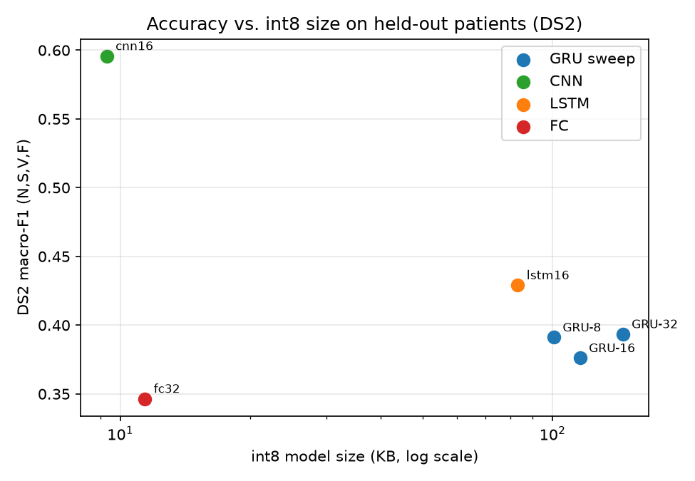
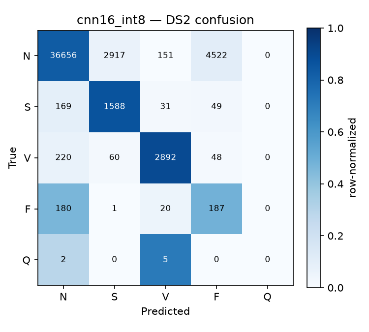

# ECG Arrhythmia Detection — Beat Classification for a Microcontroller Budget

On-device beat-level arrhythmia classification sized for a wearable-class microcontroller
(ARM Cortex-M4, ~256 KB–1 MB RAM, no FPU reliance, coin-cell power budget). The project is
built around one honest sentence:

> **A 9.3 KB int8 model reaches 0.60 macro-F1 (N,S,V,F) on held-out patients, at an estimated
> sub-millisecond inference on a Cortex-M4-class chip.**

It is also an honest account of a hypothesis that failed: a GRU was the starting bet, and the
experiments say a 1D-CNN is the better edge model on every axis. That result — and the
methodology that makes it trustworthy — is the point.

## Why on-device
A wearable arrhythmia monitor cannot depend on a cloud round-trip: latency, patient-data
privacy, and battery all argue for classifying each beat on the device itself. The deployment
constraint — not the choice of model — is the subject.

## What makes the numbers trustworthy
- **Patient-independent (inter-patient) split.** Train and test never share a patient
  (de Chazal et al. 2004, DS1/DS2). Random beat-level splits leak patient identity and inflate
  accuracy; this project refuses that shortcut. See [`data/DATA_CARD.md`](data/DATA_CARD.md).
- **AAMI 5-class scheme** (N, S, V, F, Q), never bare accuracy — the data is ~86–91% class N,
  so every result is reported per class (sensitivity, specificity, PPV, F1) and as macro-F1.
- **Class-weighted loss**, not synthetic oversampling of waveforms.
- **Quantization is measured, not asserted** — before/after macro-F1 on the same DS2 patients.
- **Multi-seed reporting.** Wearable-sized models are high-variance; results are the mean ± std
  over 3 seeds, and the deployed model is selected on validation, never on the test set.

## Status
- [x] Phase 1 — Data & preprocessing (WFDB acquisition, 0.5–40 Hz bandpass, per-record z-score,
  180-sample beat windows, RR-interval features, patient-independent DS1/DS2 split).
- [x] Phase 2 — Full-precision GRU training with class-weighted loss and macro-F1 selection.
- [x] Phase 3 — Architecture shrink, int8 quantization, edge size/latency estimation, C array.
- [x] Phase 4 — CNN / LSTM / fully-connected baselines at matched scale.

---

## Method notes that mattered

**RR-interval features rescue the S class.** Supraventricular (S) beats are defined largely by
*prematurity*, not morphology; a single centered beat window is blind to timing. Four
dimensionless RR-ratio features (pre/post RR over the record and local average) are fed
alongside the waveform. Measured train separation: pre-RR/avg ≈ 1.03 (N), 0.70 (S), 0.71 (V).
Adding them lifted S sensitivity from 0.00 to 0.64 on the GRU before any architecture change.
RR is trivially computable on-device from R-peak spacing with a running average.

**TFLite Micro has no GRU/LSTM kernel with a dynamic loop.** A recurrent model must be
*unrolled* into basic ops to run on the microcontroller runtime, and unrolling a 180-step
sequence duplicates the recurrent weights per step — a 4 k-parameter GRU ballooned to a
**563 KB** flatbuffer. Feeding the beat as 18 timesteps × 10 samples instead of 180 × 1 cut that
to ~100–145 KB while keeping a real GRU. A 1D-CNN sidesteps the whole problem: it quantizes
*natively* to int8 (Conv1D → Conv2D), no unrolling, no weight duplication.

---

## Results — GRU architecture sweep (held-out DS2 patients)

int8 vs. float32 on the same test patients, macro-F1 over N,S,V,F (Q is near-empty under the
non-paced inter-patient protocol and excluded from the headline metric — see the data card).

| Model | Params | int8 size | Macro-F1 float → int8 | 3-seed test mean ± std | Est. Cortex-M4 latency¹ |
|---|---:|---:|---:|---:|---:|
| GRU-32 | 4,901 | 145.4 KB | 0.387 → 0.394 | 0.377 ± 0.032 | 0.9–1.1 ms |
| GRU-16 | 1,765 | 115.8 KB | 0.375 → 0.376 | 0.373 ± 0.002 | 0.3–0.4 ms |
| GRU-8  |   773 | 100.7 KB | 0.391 → 0.391 | 0.421 ± 0.051 | 0.1–0.1 ms |

Two findings survive the noise: **int8 quantization is lossless-to-beneficial** (never worse than
float by more than rounding), and **there is no accuracy gain from more GRU capacity** — all three
sizes overlap within variance, so the edge argument says take the smallest. Note also that int8
size is dominated by the *unrolled graph*, not parameters: GRU-8 has 6× fewer weights than GRU-32
but only 1.4× smaller flash.

¹ Simulated, **not measured on hardware**: MACs ÷ (1 MAC/cycle, CMSIS-NN int8) at 64/80 MHz.
Physical measurement is the stretch goal.

## Results — baseline comparison (the hypothesis test)

Same RR features, same patient-independent split, matched scale; deployed model selected on
validation over 3 seeds.

| Model | Params | int8 size | Macro-F1 (N,S,V,F) | TFLite Micro path |
|---|---:|---:|---:|---|
| GRU-16 | 1,765 | 115.8 KB | 0.376 | unroll-required |
| LSTM-16 | 2,149 | 83.1 KB | 0.429 | unroll-required |
| **CNN-16** | 1,845 | **9.3 KB** | **0.596** | **native int8** |
| FC-32 | 6,469 | 11.4 KB | 0.347 | native int8 |

The GRU bet does not survive contact with the data. **A 1D-CNN with the same features is 12×
smaller (9.3 KB vs 115.8 KB), ~1.6× more accurate (0.60 vs 0.38 macro-F1), and quantizes without
the unrolling pathology.** LSTM-16 also beats GRU-16 here while carrying more parameters — so the
GRU's parameter-efficiency argument doesn't translate into a deployment or accuracy win either.
FC is the floor, as expected, despite the most parameters.



## The recommended model — CNN-16, int8, 9.3 KB (DS2)

| Class | Support | Sensitivity | Specificity | PPV | F1 |
|---|---:|---:|---:|---:|---:|
| N | 44,246 | 0.829 | 0.895 | 0.985 | 0.900 |
| S | 1,837 | 0.865 | 0.938 | 0.348 | 0.496 |
| V | 3,220 | 0.898 | 0.996 | 0.933 | 0.915 |
| F | 388 | 0.482 | 0.906 | 0.039 | 0.072 |
| Q | 7 | — | — | — | — |

Accuracy 0.83, macro-F1 (N,S,V,F) **0.596**. S sensitivity 0.86 and V F1 0.92 are competitive with
published inter-patient work — in a model that fits in 9.3 KB of flash.


## Edge deployment
- **Flash:** 9.3 KB (the int8 `.tflite`), exported to a C array in
  [`firmware/model_data.cc`](firmware/model_data.cc) for direct `#include` in firmware.
- **RAM (tensor arena):** requires the TFLite Micro memory planner on the target toolchain; not
  captured by the desktop interpreter here and therefore not reported as a measured number.
- **Latency:** estimated sub-millisecond on a Cortex-M4 (see footnote 1), vastly under the
  ~0.6–1 s between beats at resting heart rate. Simulated, not measured.

## Reproduce
```bash
pip install -r requirements.txt
python download_data.py        # WFDB files -> data/raw/mitdb/
python preprocess.py           # -> data/processed/mitbih_ds1ds2.npz
python sweep.py                # 3-seed GRU-32/16/8 sweep, validation-selected
python build_table.py          # GRU quantization + edge table -> results/
python baseline_compare.py     # CNN / LSTM / FC comparison -> results/
python make_figures.py         # figures/
```

## Honest limitations
- **F is effectively unlearnable under this protocol.** 372 of ~415 DS1 fusion beats belong to a
  single patient (208); with no F-diverse training patients, F precision collapses (F1 ≈ 0.07)
  for every model. This is a dataset property, not a modeling bug, and is reported as-is.
- **Validation is a weak predictor of test** at this scale — the F=30 validation minority is
  noise-dominated, so best-val seeds did not reliably give best-test. Model selection still uses
  validation only (the sole honest criterion), with this caveat stated.
- **Single lead (MLII)** only; not a multi-lead clinical montage.
- **R-peaks are ground-truth annotations**, not a real-time detector — this is a beat
  *classification* study, not an end-to-end streaming pipeline. A Pan-Tompkins front end is the
  natural next step.
- **Latency/RAM are simulated**, not measured on a physical board.
- **Q is near-empty** under the non-paced inter-patient protocol and is not a meaningful class here.
- Not clinically validated.

## Repository layout
```
config.py            single source of truth: split, AAMI mapping, window, RR + timestep params, paths
download_data.py     MIT-BIH WFDB acquisition (idempotent)
preprocess.py        filter, segment, RR features, patient-independent split -> .npz
model.py             GRU (reshaped, unroll-capable for TFLite Micro)
baselines.py         CNN, LSTM, fully-connected architectures
train.py             class-weighted training, macro-F1 early stopping (reusable train_model)
metrics.py           per-class sensitivity/specificity/PPV/F1, macro-F1
evaluate.py          DS2 evaluation + confusion matrix
quantize.py          int8 TFLite conversion (unrolled twin for RNNs), accuracy cost
benchmark_edge.py    flash size, MAC count, simulated Cortex-M4 latency
sweep.py             multi-seed architecture sweep, validation-based selection
build_table.py       headline size/accuracy/latency table
baseline_compare.py  matched-scale baseline comparison
make_figures.py      accuracy-vs-size and confusion figures
firmware/            C-array export of the deployed int8 model
data/DATA_CARD.md    split protocol, label mapping, class distribution, caveats
```
